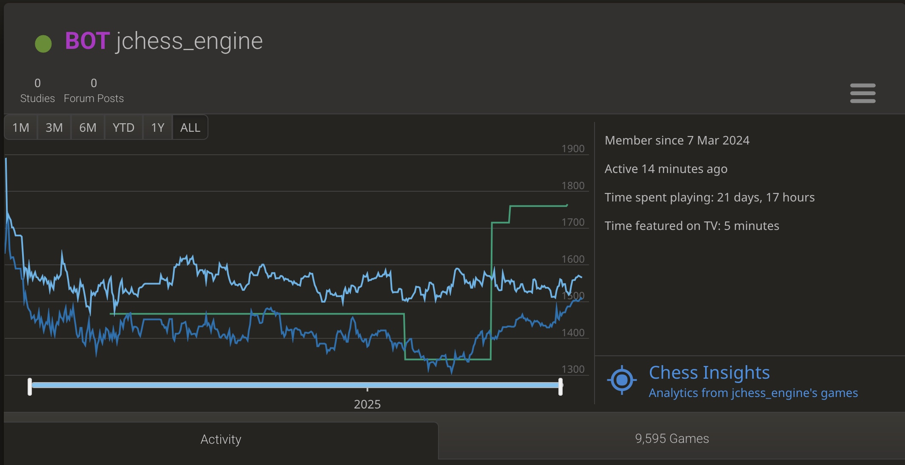

# JChess Engine

A C++20 UCI chess engine. 

Play it on lichess: https://lichess.org/@/jchess_engine.

## Note

This project was originally written and deployed to GCP in 2024.

There were two main motivations for this project:
- Gain an understanding of the tools and techniques for developing and monitoring performance critical code
- Develop a moderately complicated application end to end.